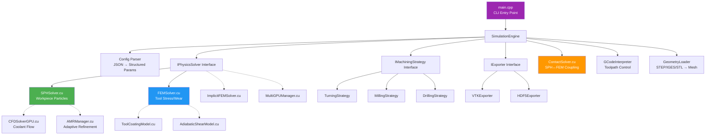

# EdgePredict Engine v4 — Complete Project Analysis

## System Environment

| Component | Status |
|-----------|--------|
| **GPU** | NVIDIA GeForce RTX 5060 Ti (16 GB VRAM, SM 12.x Blackwell) |
| **Driver** | 581.80 |
| **CUDA Runtime** | 13.0 |
| **CUDA Toolkit (nvcc)** | ❌ **NOT INSTALLED** — `nvcc` not found in PATH |
| **CMake** | ❌ **NOT INSTALLED** — `cmake` not found in PATH |
| **OS** | Windows |

> [!CAUTION]
> CUDA Toolkit and CMake are not installed/in PATH. These are the first things we need to set up before any compilation.

---

## Architecture Overview



---

## Source File Inventory

### Core Engine (15 C++ / 9 CUDA files)

| File | Lines | Purpose | Maturity |
|------|-------|---------|----------|
| [main.cpp](file:///c:/EDGEPREDICT/edgepredict-engine-v3-main/src/main.cpp) | 174 | CLI entry point, solver wiring | ✅ Solid |
| [SimulationEngine.cpp](file:///c:/EDGEPREDICT/edgepredict-engine-v3-main/src/SimulationEngine.cpp) | 351 | Orchestrator: init → loop → export | ✅ Solid |
| [Config.cpp](file:///c:/EDGEPREDICT/edgepredict-engine-v3-main/src/Config.cpp) | 298 | JSON parsing + validation | ✅ Solid |
| [SPHSolver.cu](file:///c:/EDGEPREDICT/edgepredict-engine-v3-main/src/SPHSolver.cu) | 952 | Workpiece SPH (Poly6/Spiky kernels, Tait EOS, JC damage) | ✅ Core physics done |
| [FEMSolver.cu](file:///c:/EDGEPREDICT/edgepredict-engine-v3-main/src/FEMSolver.cu) | 680 | Tool FEM (spring-mass, Von Mises stress, Usui wear) | ⚠️ Simplified model |
| [ContactSolver.cu](file:///c:/EDGEPREDICT/edgepredict-engine-v3-main/src/ContactSolver.cu) | 391 | SPH↔FEM contact + friction + heat gen | ⚠️ Spatial hash incomplete |
| [CFDSolver.cpp](file:///c:/EDGEPREDICT/edgepredict-engine-v3-main/src/CFDSolver.cpp) | ~800 | Coolant flow simulation (CPU side) | ⚠️ Not wired into engine loop |
| [CFDSolverGPU.cu](file:///c:/EDGEPREDICT/edgepredict-engine-v3-main/src/CFDSolverGPU.cu) | ~550 | GPU-accelerated CFD | ⚠️ Not wired into engine loop |
| [GeometryLoader.cpp](file:///c:/EDGEPREDICT/edgepredict-engine-v3-main/src/GeometryLoader.cpp) | 329 | STEP/IGES/STL → Triangle mesh (OpenCASCADE) | ✅ Working |
| [GCodeInterpreter.cpp](file:///c:/EDGEPREDICT/edgepredict-engine-v3-main/src/GCodeInterpreter.cpp) | ~280 | G-code → toolpath | ✅ Working |
| [TurningStrategy.cpp](file:///c:/EDGEPREDICT/edgepredict-engine-v3-main/src/TurningStrategy.cpp) | ~340 | Turning kinematics + forces | ⚠️ Connected but not exercised |
| [MillingStrategy.cpp](file:///c:/EDGEPREDICT/edgepredict-engine-v3-main/src/MillingStrategy.cpp) | ~360 | Milling kinematics + forces | ⚠️ Connected but not exercised |
| [DrillingStrategy.cpp](file:///c:/EDGEPREDICT/edgepredict-engine-v3-main/src/DrillingStrategy.cpp) | ~230 | Drilling kinematics | ⚠️ Connected but not exercised |
| [VTKExporter.cpp](file:///c:/EDGEPREDICT/edgepredict-engine-v3-main/src/VTKExporter.cpp) | ~200 | VTK file export for visualization | ✅ Working |
| [HDF5Exporter.cpp](file:///c:/EDGEPREDICT/edgepredict-engine-v3-main/src/HDF5Exporter.cpp) | ~340 | HDF5 export (optional) | ✅ Working |
| [MultiGPUManager.cu](file:///c:/EDGEPREDICT/edgepredict-engine-v3-main/src/MultiGPUManager.cu) | ~410 | Multi-GPU support | 🔮 Future |
| [AMRManager.cu](file:///c:/EDGEPREDICT/edgepredict-engine-v3-main/src/AMRManager.cu) | ~220 | Adaptive mesh refinement | 🔮 Future |
| [ImplicitFEMSolver.cu](file:///c:/EDGEPREDICT/edgepredict-engine-v3-main/src/ImplicitFEMSolver.cu) | ~300 | Implicit time integration | 🔮 Future |
| [AdiabaticShearModel.cu](file:///c:/EDGEPREDICT/edgepredict-engine-v3-main/src/AdiabaticShearModel.cu) | ~220 | Adiabatic shear band | 🔮 Future |
| [ToolCoatingModel.cu](file:///c:/EDGEPREDICT/edgepredict-engine-v3-main/src/ToolCoatingModel.cu) | ~260 | Tool coating wear | 🔮 Future |
| [OptimizationManager.cpp](file:///c:/EDGEPREDICT/edgepredict-engine-v3-main/src/OptimizationManager.cpp) | ~280 | PID-based adaptive control | 🔮 Future |
| [SurfaceRoughnessPredictor.cpp](file:///c:/EDGEPREDICT/edgepredict-engine-v3-main/src/SurfaceRoughnessPredictor.cpp) | ~320 | Surface roughness prediction | 🔮 Future |
| [ResidualStressAnalyzer.cpp](file:///c:/EDGEPREDICT/edgepredict-engine-v3-main/src/ResidualStressAnalyzer.cpp) | ~240 | Residual stress analysis | 🔮 Future |

---

## Physics Pipeline — What Actually Runs

The current simulation loop (`SimulationEngine::runMainLoop`) executes this per time step:

```
For each step (1..numSteps):
  1. computeAdaptiveTimeStep()     — CFL-based dt from all solvers
  2. step(dt):
     a. GCode → MachineState       — tool position/speed from G-code
     b. strategy.applyKinematics() — tool/workpiece rotation
     c. FOR EACH solver:
        • SPHSolver.step(dt)       — Leapfrog KDK integration
        • FEMSolver.step(dt)       — Spring forces + Velocity Verlet
  3. Every N steps: updateMetrics() + VTK export
```

### SPH Solver (workpiece) — Per-Step Pipeline:
```
Kick (half-step velocity) → Drift (position) → LOD zones → Spatial hash → 
Density/Pressure (Poly6 + Tait EOS) → Forces (Spiky gradient + viscosity) → 
Kick (complete velocity) → [every 5 steps: Strain rate → JC Damage → Chip separation]
```

### FEM Solver (tool) — Per-Step Pipeline:
```
Tool rotation → Spring forces → Velocity Verlet integration → 
Von Mises stress → Thermal conduction → Usui wear update
```

> [!WARNING]
> **ContactSolver is initialized in main.cpp but NEVER called during the simulation loop!** The `contactSolver.resolveContacts(dt)` call is completely missing from `SimulationEngine::step()`. This means **SPH particles and FEM nodes never interact** — tool cuts through the workpiece like a ghost.

> [!WARNING]
> **Machining strategy is not created in main.cpp!** `engine.setStrategy(...)` is never called. So `m_strategy` is null, and no kinematics (tool rotation, workpiece rotation) are applied.

---

## 🚨 Critical Issues Found for Output Validation

### Issue 1: No Contact Resolution in Simulation Loop
The `ContactSolver` is created and initialized in `main.cpp` (line 134-139) but it's a local variable — never registered with the engine and never called during stepping. **Without contact, there are no cutting forces, no heat generation, no chip formation.**

### Issue 2: No Machining Strategy Registered
`MachiningStrategyFactory::create()` exists but is never called. Without a strategy, there's no tool rotation (milling/drilling) or workpiece rotation (turning), and no cutting kinematics.

### Issue 3: FEM Stress Model is Over-Simplified
The stress computation in `computeStressKernel` (FEMSolver.cu:131-148) uses:
```
strain = displacement / L0  (where L0 = 1mm hardcoded)
stress = E × strain
```
This is a very rough approximation — it doesn't use actual spring extensions or a proper stress tensor. For validation, this will produce order-of-magnitude stress values but not accurate distributions.

### Issue 4: SimulationEngine.loadGeometry() Throws on Empty Tool Path
The `loadGeometry()` method (line 183-184) throws an exception if `toolGeometry` is empty. But `input_turning.json` has an empty `tool_geometry` field. This means **the turning test case would crash immediately**.

### Issue 5: gcode_file Parsing Bug in Config.cpp
gcode_file is read from the top-level JSON (line 92):
```cpp
m_filePaths.gcodeFile = j.value("gcode_file", "");
```
But in both input JSON files, `gcode_file` is under `file_paths`, not at the top level. So the G-code is never loaded — the engine falls back to manual positioning.

### Issue 6: Metrics Report Zeroes
Because `ContactSolver` doesn't run, stress stays at 0 until FEM computes displacement-based stress (which only happens if the tool mesh is loaded and has springs). Temperature stays at ambient (25°C) because no friction heat is generated.

---

## Dependencies Required for Native Windows Build

| Dependency | Purpose | Install Method |
|------------|---------|---------------|
| **CUDA Toolkit 13.0** | nvcc compiler, CUDA runtime, Thrust | [NVIDIA CUDA Downloads](https://developer.nvidia.com/cuda-downloads) |
| **CMake ≥3.18** | Build system | `winget install Kitware.CMake` or [cmake.org](https://cmake.org/download/) |
| **Visual Studio 2022** | MSVC C++ compiler (cl.exe) | VS Installer → "Desktop development with C++" |
| **Eigen3** | Linear algebra (header-only) | vcpkg or manual download |
| **OpenCASCADE 7.x** | STEP/IGES geometry loading | vcpkg or [opencascade.com](https://dev.opencascade.org) |
| **nlohmann/json** | ✅ Already included in `include/json.hpp` | N/A |
| **HDF5** (optional) | HDF5 export | vcpkg `hdf5` |

### CUDA Architecture for RTX 5060 Ti

> [!IMPORTANT]
> The RTX 5060 Ti is Blackwell architecture (SM 12.0). The current CMakeLists.txt defaults to `CMAKE_CUDA_ARCHITECTURES=75` (Turing). This **must** be updated to `120` for your GPU, or compilation will produce code that can't run on your hardware.

---

## Build System Assessment

The [CMakeLists.txt](file:///c:/EDGEPREDICT/edgepredict-engine-v3-main/CMakeLists.txt) is well-structured with:
- Proper CUDA language support
- MSVC-specific optimization flags (`/O2 /arch:AVX2`)
- Conditional HDF5 
- OpenCASCADE fallback paths for Windows

What needs to change for native Windows `.exe`:
1. Remove Docker dependency entirely
2. Set correct CUDA architecture (`120` for RTX 5060 Ti)
3. Ensure all library paths resolve on Windows
4. Fix the gcode_file config parsing
5. Wire up ContactSolver into the simulation loop
6. Create and register machining strategy

---

## Docs Folder (Future Plans — NOT Current Scope)

| Doc | Summary |
|-----|---------|
| `EdgePredict_Divisions.md` | Product divisions: Edge, Pro, Enterprise |
| `Future_Advancement_Roadmap.md` | Multi-year R&D roadmap |
| `ML_Surrogate_Model_Design.md` | ML model for real-time prediction |
| `Product_Vision.md` | Commercial product vision |

These are all future implementation plans, as you noted.

---

## Summary of Current State

```
✅ Architecture: Clean, well-separated (interfaces, DI, strategy pattern)
✅ SPH physics: Solid implementation (Tait EOS, Leapfrog, JC damage, LOD)
✅ FEM basics: Working spring-mass with wear model
✅ Config system: Comprehensive JSON parsing
✅ Geometry loading: STEP/IGES/STL via OpenCASCADE
✅ G-code interpreter: Basic support
✅ Export: VTK + HDF5 pipeline

❌ ContactSolver: Created but NOT called in simulation loop
❌ MachiningStrategy: EXISTS but NOT registered in main.cpp
❌ G-code path: Config parsing bug — never loads G-code
❌ Build tools: nvcc + cmake not installed
❌ CUDA arch: Set to 75 (Turing), needs 120 (Blackwell RTX 5060 Ti)
❌ Docker files: Still present (Dockerfile + docker-compose.yml) — to be removed
```

> [!IMPORTANT]
> **Bottom line**: The engine compiles and runs but the **simulation produces meaningless results** because the contact solver (tool-workpiece interaction) is never invoked. The tool and workpiece particles exist in the same space but never interact. Fixing this is more important than any performance optimization.

---

## What to Discuss Next

1. **Should we install CUDA Toolkit + CMake + dependencies first**, then fix the physics integration bugs and compile to `.exe`?
2. Or do you want to **fix the code issues first** (contact solver, strategy registration, gcode bug) and then set up the build?
3. What's your Tauri/React UI expecting from the engine — does it call the `.exe` as a subprocess? Does it use stdout JSON, a socket, or a file-based protocol?
